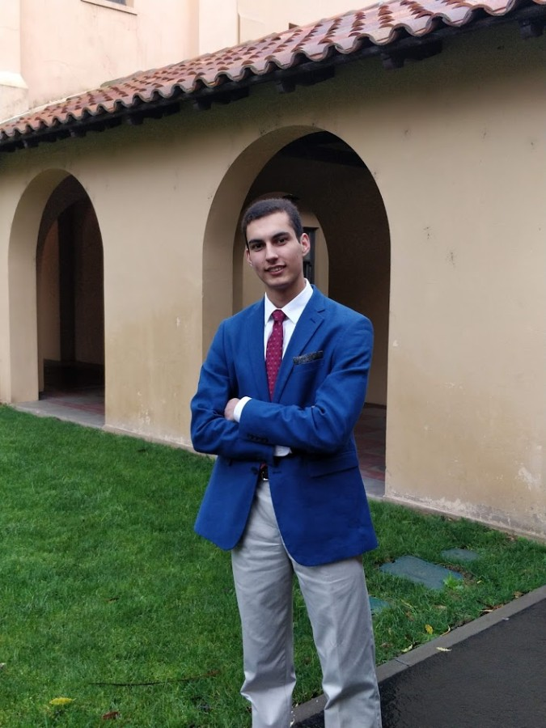

## About
I am a student at the University of Arizona currently pursuing a double major in Business Economics and MIS. With a background in computing and experiences with startups, I work well in environments ranging from small businesses to enterprises. In the past, I have worked at an IoT startup along with co-founding a registered 501(c)(3) nonprofit. Through my time as presidents of clubs, CEOs of business competitions, and as a hackathon organizer, I have developed valuable leadership skills that I intend to apply to my work in the future. 

